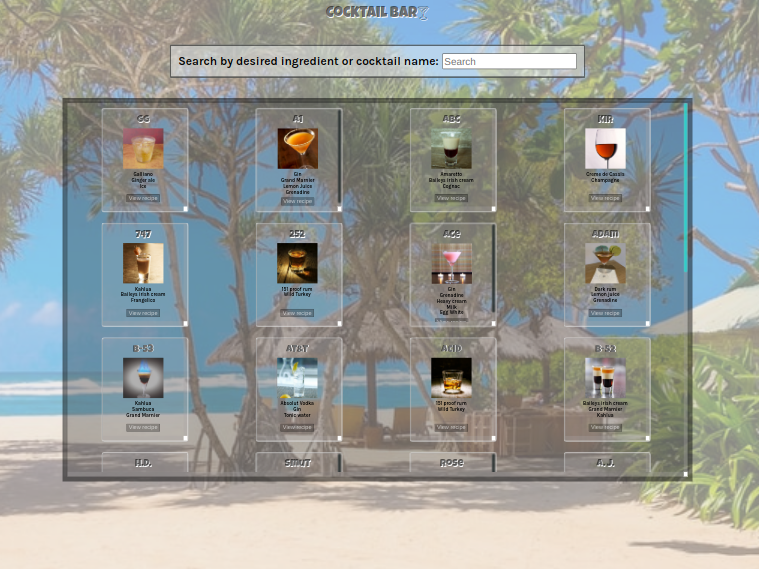
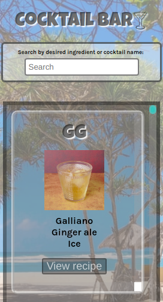
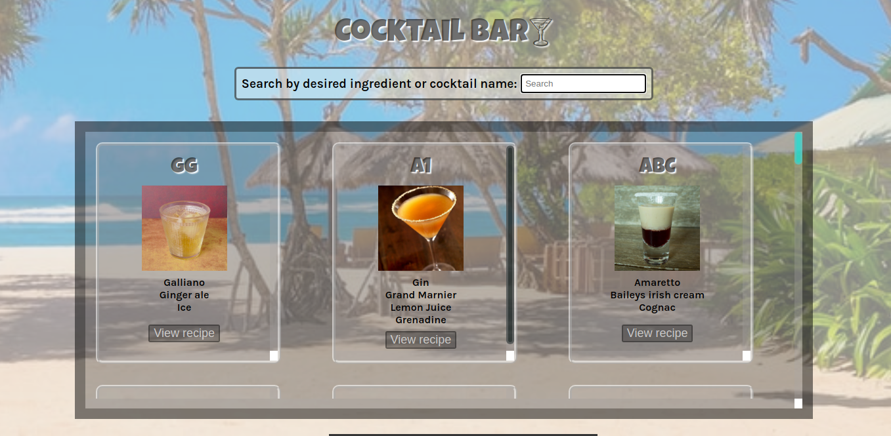
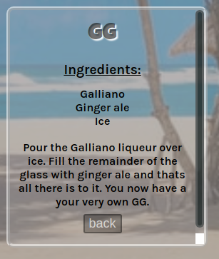
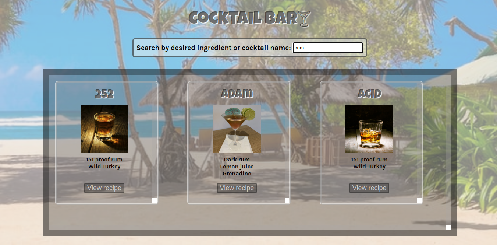

# Cocktail bar
My very first Vue Project is Cocktail bar. I practiced my skills by creating cocktails list, which calls TheCocktailDB. Also, I created a search bar to help to find cocktails by an ingredient or cocktail's name.
The website is hosted at https://cocktails-bar-vue.netlify.app/.

<div>
    <h1 style="font-size:16px;">Large Desktop Screen</h1>
    
</div>

<div>
    <h1 style="font-size:16px;">Mobile Screen</h1>
    
</div>

## Project setup
```
- git clone
- cd cocktails-vue
- npm install
- npm run serve
```
## Description

When you open the app it will show you all available cocktails. Scroll down to see them all! 
 

If you click 'view recipe' button, the back of the card will show you the recipe. To get to the front of the card click 'back' button. 
 

Also you can search cocktails by an ingredient or a name of a cocktail.
 

## Technologies

- Vue
- TheCocktailDB
- Axios
- FontAwesomeIcon
- Vue Testing Library

## Author

Viktoriia Petrova
